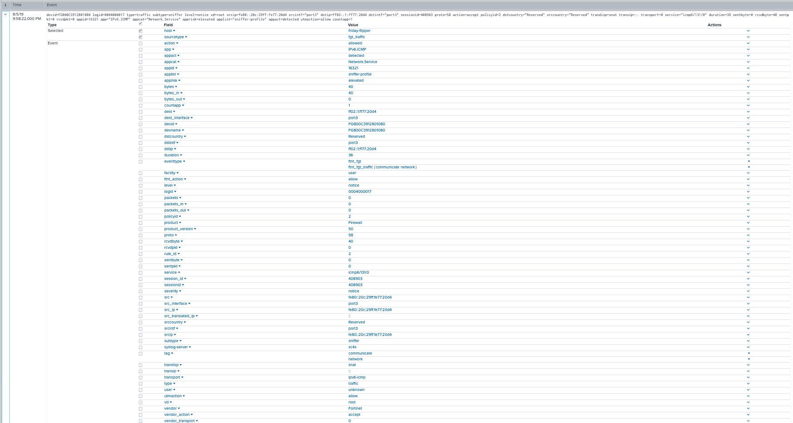
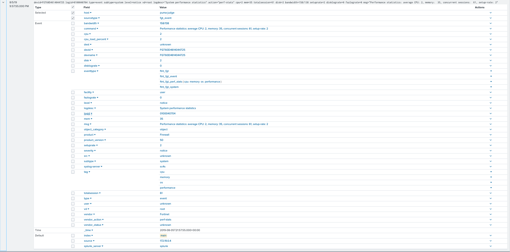

# Vendor - Fortinet

## Product - Fortigate

| Ref            | Link                                                                                                    |
|----------------|---------------------------------------------------------------------------------------------------------|
| Splunk Add-on  | https://splunkbase.splunk.com/app/2846/                                                                 |
| Product Manual | https://docs.fortinet.com/product/fortigate/6.2                                                         |


### Sourcetypes

| sourcetype     | notes                                                                                                   |
|----------------|---------------------------------------------------------------------------------------------------------|
| fgt_log        | The catch all sourcetype is not used                                                                                                     |
| fgt_traffic    | None                                                                                         |
| fgt_utm        | None                                                                                          |
| fgt_event      | None


### Sourcetype and Index Configuration

| key            | sourcetype     | index          | notes          |
|----------------|----------------|----------------|----------------|
| fortinet_fortios_traffic      | fgt_traffic      | netfw          | none          |
| fortinet_fortios_utm    | fgt_utm      | netids          | none          |
| fortinet_fortios_event    | fgt_event      | netops          | none          |
| fortinet_fortios_log    | fgt_log      | netops          | none          |


### Filter type

MSG Parse: This filter parses message content

### Setup and Configuration

* Install the Splunk Add-on on the search head(s) for the user communities interested in this data source. If SC4S is exclusively used the addon is not required on the indexer.
* Review and update the splunk_index.csv file and set the index and sourcetype as required for the data source.
* Refer to the admin manual for specific details of configuration to send Reliable syslog using RFC 3195 format, a typical logging configuration will include the following features.

```
config log memory filter

set forward-traffic enable

set local-traffic enable

set sniffer-traffic disable

set anomaly enable

set voip disable

set multicast-traffic enable

set dns enable

end

config system global

set cli-audit-log enable

end

config log setting

set neighbor-event enable

end

```

### Options

| Variable       | default        | description    |
|----------------|----------------|----------------|
| SC4S_LISTEN_FORTINET_FORTIOS_TCP_PORT      | empty string      | Enable a UDP port for this specific vendor product using the number defined |
| SC4S_LISTEN_FORTINET_FORTIOS_UDP_PORT      | empty string      | Enable a UDP port for this specific vendor product using the number defined |
| SC4S_ARCHIVE_FORTINET_FORTIOS | no | Enable archive to disk for this specific source |
| SC4S_DEST_FORTINET_FORTIOS_HEC | no | When Splunk HEC is disabled globally set to yes to enable this specific source | 

### Verification

An active firewall will generate frequent events, in addition fortigate has the ability to test logging functionality using a built in command

```
diag log test
```

Verify timestamp, and host values match as expected    

```
index=<asconfigured> (sourcetype=fgt_log OR sourcetype=fgt_traffic OR sourcetype=fgt_utm)
```

### UTM Message type


### Traffic Message Type



###Event Message Type


Verify timestamp, and host values match as expected

## Product - FortiWeb

| Ref            | Link                                                                                                    |
|----------------|---------------------------------------------------------------------------------------------------------|
| Splunk Add-on  | https://splunkbase.splunk.com/app/4679/                                                                 |
| Product Manual | https://docs.fortinet.com/product/fortiweb/6.3                                                         |


### Sourcetypes

| sourcetype     | notes                                                                                                   |
|----------------|---------------------------------------------------------------------------------------------------------|
| fweb_log        | The catch all sourcetype is not used                                                                                                     |
| fwb_traffic    | None                                                                                         |
| fwb_attack        | None                                                                                          |
| fwb_event      | None


### Sourcetype and Index Configuration

| key            | sourcetype     | index          | notes          |
|----------------|----------------|----------------|----------------|
| fortinet_fortiweb_traffic      | fwb_traffic      | netfw          | none          |
| fortinet_fortiweb_attack    | fwb_attack      | netids          | none          |
| fortinet_fortiweb_event    | fwb_event      | netops          | none          |
| fortinet_fortiweb_log    | fwb_log      | netops          | none          |


### Filter type

MSG Parse: This filter parses message content

### Setup and Configuration

* Install the Splunk Add-on on the search head(s) for the user communities interested in this data source. If SC4S is exclusively used the addon is not required on the indexer.
* Review and update the splunk_index.csv file and set the index and sourcetype as required for the data source.
* Refer to the admin manual for specific details of configuration to send Reliable syslog using RFC 3195 format, a typical logging configuration will include the following features.

```
config log syslog-policy

edit splunk  

config syslog-server-list 

edit 1

set server x.x.x.x

set port 514 (Example. Should be the same as default or dedicated port selected for sc4s)   

end

end

config log syslogd

set policy splunk

set status enable

end

```

### Options

| Variable       | default        | description    |
|----------------|----------------|----------------|
| SC4S_LISTEN_FORTINET_FORTIWEB_TCP_PORT      | empty string      | Enable a UDP port for this specific vendor product using the number defined |
| SC4S_LISTEN_FORTINET_FORTIWEB_UDP_PORT      | empty string      | Enable a UDP port for this specific vendor product using the number defined |
| SC4S_ARCHIVE_FORTINET_FORTIWEB | no | Enable archive to disk for this specific source |
| SC4S_DEST_FORTINET_FORTIWEB_HEC | no | When Splunk HEC is disabled globally set to yes to enable this specific source | 

### Verification

An active firewall will generate frequent events, in addition fortigate has the ability to test logging functionality using a built in command

```
diag log test
```

Verify timestamp, and host values match as expected    

```
index=<asconfigured> (sourcetype=fwb_log OR sourcetype=fwb_traffic OR sourcetype=fwb_attack OR sourcetype=fwb_event)
```

Verify timestamp, and host values match as expected